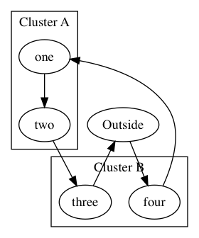

## dot - little helper package in Go for the graphviz dot language

[DOT language](http://www.graphviz.org/doc/info/lang.html)

	package main
	
	import (
		"fmt"	
		"github.com/emicklei/dot"
	)
	
	// go run main.go | dot -Tpng  > test.png && open test.png
	
	func main() {
		g := dot.NewDigraph()
		n1 := g.Node("coding")
		n2 := g.Node("testing a little").Box()
	
		g.Edge(n1, n2)
		g.Edge(n2, n1, "back").Attr("color", "red")
	
		fmt.Println(g.String())
	}

Output

	digraph {
		node [label="coding"]; n1;
		node [label="testing a little",shape="box"]; n2;
		n1 -> n2;
		n2 -> n1 [color="red", label="back"];
	}

Chaining edges

	g.Node("A").Edge(g.Node("B")).Edge(g.Node("C"))
	
	A -> B -> C

Subgraphs

	s := g.Subgraph("cluster")
	s.Attr("style","filled")

## cluster example

	di := dot.NewGraph(dot.Directed)
	outside := di.Node("Outside")

	// A
	clusterA := di.Subgraph("Cluster A", ClusterOption{})
	insideOne := clusterA.Node("one")
	insideTwo := clusterA.Node("two")
	
	// B
	clusterB := di.Subgraph("Cluster B", ClusterOption{})
	insideThree := clusterB.Node("three")
	insideFour := clusterB.Node("four")

	// edges
	outside.Edge(insideFour).Edge(insideOne).Edge(insideTwo).Edge(insideThree).Edge(outside)

## test your graph

	go run main.go | dot -Tpng  > test.png && open test.png

(c) 2015, http://ernestmicklei.com. MIT License
