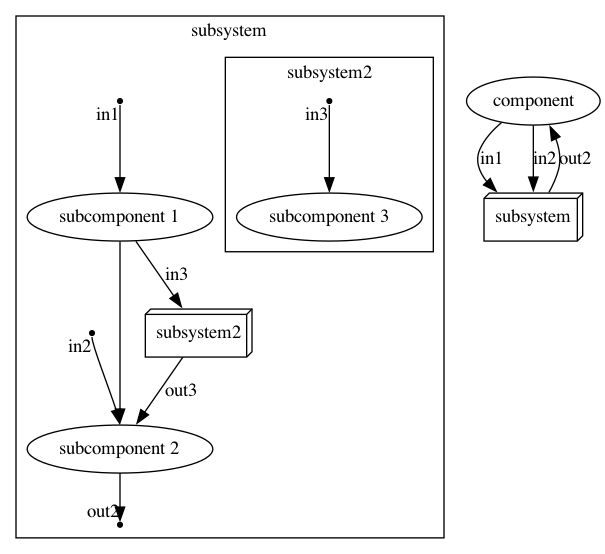
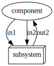
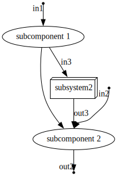
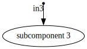

## dotx package (dot extensions)

This package contains utilities to create graphs on top of the `emicklei/dot package`.

### Composite

The `Composite` type can be used to create composition hierarchies like clustering. 

Let's examine this diagram.

On the most right, you find a node called `subsystem` which is a Composite with 2 inputs and 1 output edge.

On the most left, you see the contents of the same `subsystem` with both inputs and an output (point shaped with label on edge).

The `subsystem` contains other nodes, 2 regular nodes (`subcomponent 1` and `subcomponent 2`) and another Composite labeled `subsystem2`.

So, `subsystem` is a composition of 3 components and 1 of these components is itself a composition of a component (`subcomponent 3`).

### external option

If you create a Composite using the `ExternalGraph` kind then its graph is exported separately from the containing graph. If you visualize such a graph using `SVG` then you can **nagivate into** the subsystems.

And clicking on `subsystem`, your browse will show:

And clicking on `subsystem2`, your browse will show:

See `subsystem_test.go` for the code of these examples.

### usage pattern

    import (
        "github.com/emicklei/dot"
        "github.com/emicklei/dot/dotx"
    )

    func YourService(parent *dot.Graph) *dotx.Composite {
        // external means it exports its own DOT file
        sub := dotx.NewComposite("Your Service", parent, dotx.ExternalGraph)

        // export right after building the inner graph
        return sub.Export(func(g *dot.Graph) {
            
            // build the inner graph of the Composite
            myComp := g.Node("myComp")
            
            // connect any inputs,outputs
            sub.Input("in", myComp)
        })
    }